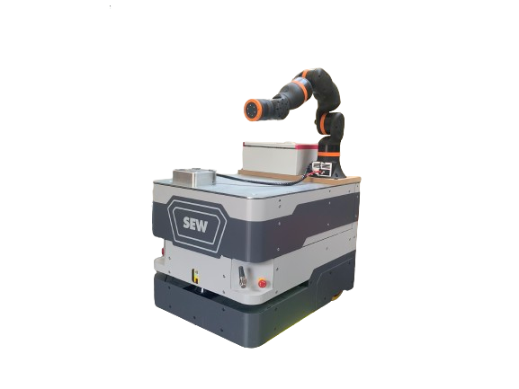
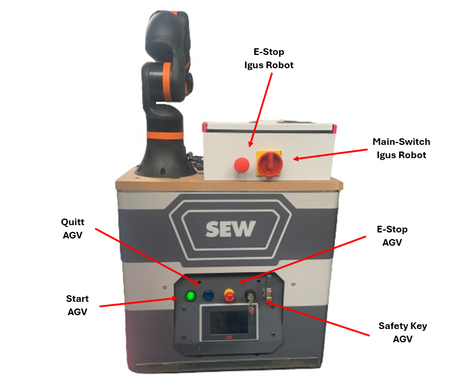
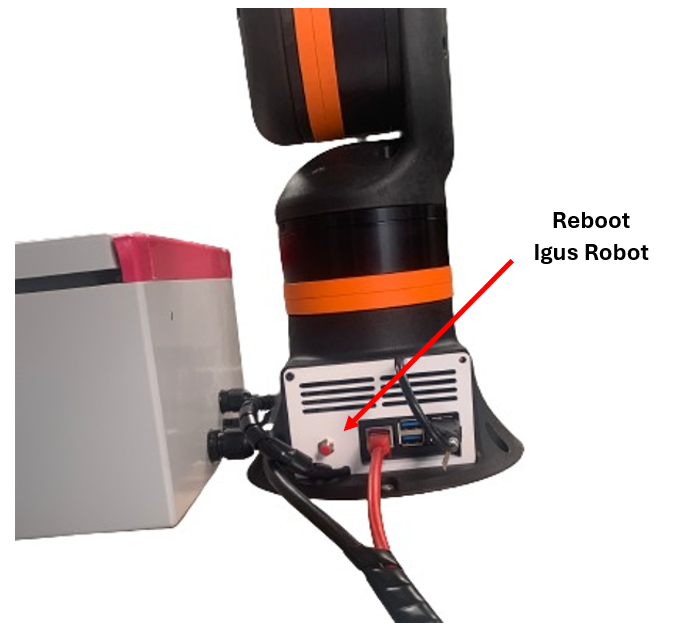
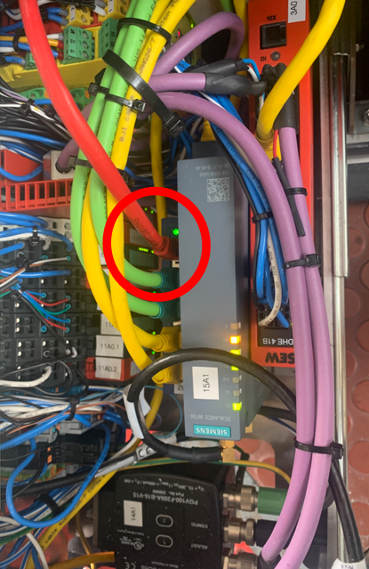
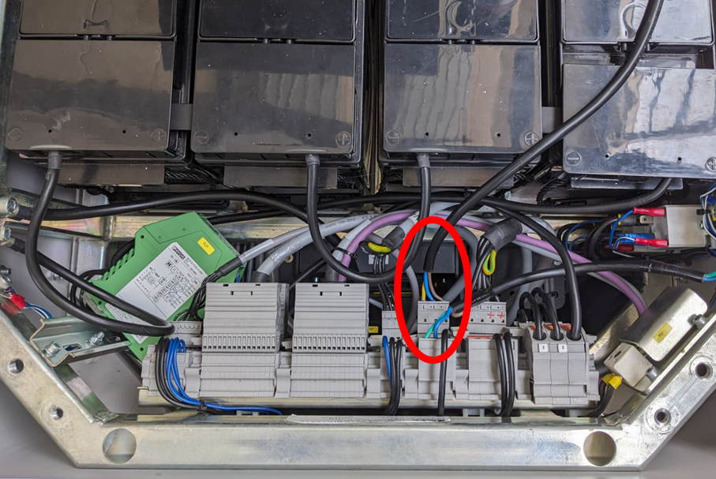

# igus_rebel_ros2_docker

 

## Repo Structure and ROS2 Packages
This is a core breakdown of the official documentation to the FE-Project of Hannes Bornamann, Mathias Fuhrer and Robin Wolf at the Hochschule Karlsruhe (SS24). The main repo with the project documentation can be found [here](https://github.com/mathias31415/igus_rebel_on_sew_agv). This readme should guide users to get familiar with the igus rebel 6DoF robot arm and its capabilities. Deeper informations and background knowledge is provided in the offical documentation only.
The docker container provided inside this repo runs on the RasperryPi inside the robot base and handles all tasks of the robot control. Moreover the same container can be used by a user to control the robot via RVIZ-GUI or self written high level control scripts. The users PC has just to be logged in a the hosted local network.

## Usage of containerized enviroments with Docker
### Introduction:
The usage of Docker is a common praxis when working with ROS2. The biggest advantage of devbeloping a ROS2 ecosystem inside a containerized enviroment is that it can be used independent of the host hardware.
Everyone who wants to use this repo has just to clone the repo from GitHub to the local disk and run the Dockerfile. No ROS2 installation on the host machine necessary !
All needed ROS2-Packages are installed and set up by default when running the Dockerfile. Moreover the network setup for the ROS2 Node communication over topics with fast-RTPS defined in the dds_profile.xml is done automatically.

To use the providede Dockerfile the following prequisities are required on your host machine:

- Ubuntu 22.04 (NOT in a Virtual Machine !) https://ubuntu.com/tutorials/install-ubuntu-desktop#1-overview
- Working installation of Docker Engine https://docs.docker.com/engine/install/ubuntu/

### Preperations on the RasperryPi/ Hardware-PC:

***--- These steps are only required if you want to exchange our RasperryPi 5 in the robot base ---***  

#### Installations:
We use a RaspberryPi 5 with 8GB RAM and installed Ubuntu 24.04 on it using the [Raspberry Pi Imager](https://www.raspberrypi.com/software/).
On Ubuntu we then installed docker acording to this [tutorial](https://docs.docker.com/engine/install/ubuntu/). We also recomend to install terminater `sudo apt install terminator`.

Depending on whether you want to use the software on your PC (with amd64 processor) or on a RaspberryPi (with arm64 processor) you have to change the base image in the `Dockerfile` file, by comenting/ uncomenting the following lines:
```shell
# For PC with amd64: (https://hub.docker.com/r/osrf/ros/tags?page=1&page_size=&name=&ordering=?)
FROM osrf/ros:$ROS_DISTRO-desktop AS base

# For RaspberryPi with arm64: (https://hub.docker.com/r/arm64v8/ros/tags)
FROM arm64v8/ros:$ROS_DISTRO AS base
```

#### Clone the provided Repository:
  
```git clone https://github.com/mathias31415/igus_rebel_ros2_docker.git```

#### Configure Autostart with Systemd Services:
To perform the autostart capabilities of our system on a different PC connected to the hardware (instead of the RasperryPi 5 provided), you have to do some additional configurations on your hardware-PC/ RasperryPi.

1) change the path placeholders ```YOUR_PATH``` in the ```<name>.service``` files to the ABSOLUTE path to your cloned repo (igus_rebel_ros2_docker)
2) move all ```<name>.service``` files to ```/etc/systemd/system``` (sudo required)
3) enable and activate every single systemd service with ```sudo systemctl enable <name>.service``` and ```sudo systemctl start <name>.service```

If you reboot the hardware PC now, the configuration of the used CAN-adapter and WIFI-hotspot is done automatically. When pressing the red reboot-buttton (connected to RasperryPi GPIO 18/ GND), a safe-reboot should be executed.

#### Build and Start the Docker Container:
1) move to the cloned repo
2) open the ```Dockerfile``` and make sure the line ```CMD ["ros2", "launch", "irc_ros_bringup", "rebel_on_agv.launch.py", "hardware_protocol:=mock_hardware"] ``` is a comment and the line ```CMD ["ros2", "launch", "irc_ros_bringup", "rebel_on_agv.launch.py"]``` executable code  
3) build the container with ```./build_docker.sh``` (active WIFI-connection required!)
4) start the container with ```./start_docker.sh``` 
5) kill the current terminal with ctrl+C
6) check if the container ```igusrebel``` is still running in the background with ```docker ps```


## Provided ROS2-Packages
### Description Packages:

The description packages provide the full kinematic definition and CAD data of our robot system. In ROS2 the kinematics of the robot is defined in a URDF model. The URDF model can be structred by using the xacro package and define sub-macros which are all put together in the main URDF.
Moreover some tags regarding the hardware-communication with ROS2-Control and some tags are specified in these packages too.  
**Note:** The AGV part of the robot system is managed in a seperate container and can not be controlled by using this container only. Here, its just a static model for collision avoidence.

- irc_ros_description: kinematic description and ros2 control definitions of the Igus ReBel Arm (cloned from https://github.com/CommonplaceRobotics/iRC_ROS/tree/humble/irc_ros_description)
- sew_agv_description: kinematic description of the sew-maxo-mts AGV at Hochschule Karlsruhe
- sew_and_igus_description: combined kinematic description of the arm and the AGV to one united robot with more DoF.

### Bringup and Control Packages:

These packages provide further functionalities for hardware communication.

- irc_ros_bringup: handles the correct bringup of all needed ROS2 nodes and has to be launched by the user to start the system (see How To) (cloned from https://github.com/CommonplaceRobotics/iRC_ROS/tree/humble/irc_ros_bringup, but highly modified !)
- irc_ros_controllers: defines the dio-controller to use the dio ports on the igus robot arm. These are currently not available, because the HKA bought the open-source version of the robot. On this version no hardware dio ports are available (cloned from https://github.com/CommonplaceRobotics/iRC_ROS/tree/humble/irc_ros_controllers).   
- irc_ros_hardware: defines the controller with a hardware interface for CAN communication between the container and the different axis modules (cloned from https://github.com/CommonplaceRobotics/iRC_ROS/tree/humble/irc_ros_hardware)
- irc_ros_msgs: defines several custom messages and service types needed for communication purposes when the robot system is active (cloned from https://github.com/CommonplaceRobotics/iRC_ROS/tree/humble/irc_ros_msgs)
  
### Motion Planning and Application Packages:

These packages provide all functionalities regarding the robots motion planning and the user interface.

- trac-ik: contains the sourcecode and plugin definition for an advanced IK-solver which is used by MoveIt in our configuration (cloned from https://bitbucket.org/traclabs/trac_ik/src/rolling-devel/)
- sew_and_igus_moveit_config: configuration of the motion planning capabilities with MoveIt2 embedded in ROS2 and handling of the needed nodes to plan and execute trajectories.
- moveit_wrapper: provides service servers which can control the motion planning capabilities through the C++ move_group interface
- igus_moveit_clients: provides a python class handling clients which connect to the servers from the warpper package. The user can call the class methods from a supervised python file to provide a simple approach of using MoveIt2 motion planning capabilities.
- robot_application: this package provides a simple programmable interface for the ROS2 ecosystem. The user can implement his own supervised control logic in python code to move the robot system in simulation and real world by calling the metods provided in the clinet classes (see How To)

## How-To Operate the real Robot from a User PC
### Hardware Overview:

The following graphic shows all of the needed hardware buttons and switches.  
 

### Mount the Robot on the AGV:

**Note:** This should only be done by experienced and authorized personal with deactivated AGV!

1) remove the steel plate on the top of the AGV by 4 bolts
2) slide the steel plate to the back of the AGV to get access to the electrics in front of the batteries
3) place the plate with the igus and the cabinet on top of the agv
4) push the power and ethernet cable to the hub mounted on the AGVs steel plate
5) connect the ethernet cable to the switch in the AGVs electrics drawer (red cable):  
   
6) connect the power cable to the electrical load hub:  
   
7) mount the AGVs steel plate witn 2 M8 bolts in the front and mount the robot plate with 3 M8 bolts in the back
8) turn on the agv and the robot to check functionality

### Start the Robot:

1) turn on the AGV by pressing and holding the green and blue button for a few seconds
2) check, if the emergency stop is not pushed, if so then pull the emergency-stop out to enable the robot to start
3) turn on the main switch
4) wait until the robot has completely booted. You should hear a quiet "klick" when the brakes release and you should notice a new local network named "AGV" is hosted by the robot. Moreover light og the green button on the AGV goes out.
5) clone the repo on your private user PC with ```git clone https://github.com/mathias31415/igus_rebel_ros2_docker.git```
6) navigate to the Dockerfile, make the line ```CMD ["ros2", "launch", "irc_ros_bringup", "rebel_on_agv.launch.py", "hardware_protocol:=mock_hardware"] ``` to a comment and the line ```CMD ["ros2", "launch", "irc_ros_bringup", "rebel_on_agv.launch.py"]``` to executable code  
    (**Note:** kill and remove the old container if its running in the background with ```docker kill igusrebel``` and ```docker rm igusrebel```)
7) build the ```igusrebel``` docker container with ```./build_docker.sh``` and start it with ```start_docker.sh``` (**Important:** during these steps, you are not allowed to be logged in to the robots private network!) 
8) after the container has started, kill the opened terminal with ctrl+C, the container keeps running in the background
9)  connect your user PC to the robots local network named "AGV" (password: "agv12345")
10) kill and restart the docker container to pass the new network settings with ```docker kill igusrebel``` and ```docker start igusrebel```
11) open another terminal window and connect to the container with ```docker exec -it igusrebel bash```
12) source the workspace with ```source install/setup.bash```
    
**Note:** steps 5 is only recommendet for the first usage and 6, 7 after switching between real hardware and mock hardware, for any further usages these steps can be skipped.

### Restart the Robot after an Emergency Stop:

1) pull the emergency-stop out to enable the robot to start
2) reboot the roboot by pressing the small red button on the robot base
3) go back to 4) above

### Move the Robot with RVIZ:

1) move to the newly opened terminal window from 10) above
2) launch RVIZ with: ```ros2 launch irc_ros_bringup rviz.launch.py``` 
3) wait until RVIZ has opened and the robot is completely visible
4) try to move the robot with the interactive marker on the tcp or in the window at the bottom right (MotionPlanning/Joints). The oragne goal state should have moved to your recommendet pose.
5) PTP: plan and execute the trajectory with the "plan and execute" button in the window at the bottom right (MotionPlanning/Planning).   
   LIN: click the checkbox "Use Cartesian Path" and then press the "plan and execute" button in the window at the bottom right (MotionPlanning/Planning).

The robot shold move now. (**Hint**: you can change planning algorithms and parameters to experience the different robot behaviors)

### Run own Control Scripts:

Its recommendet to do these tasks in a terminal window parallel to using RVIZ, because all motions can be checked here with mock hardware before using the real hardware.

1)  connect a new, second terminal to the running container on your user PC with: ```docker exec -it igusrebel bash``` and source inside the new terminal with ```source install/setup.bash```
2)  execute your supervised control script: ```ros2 run robot_application <your_control_script>```
3)  you should see the robots motion in RVIZ and your codes terminal feedback prints in the second terminal
   
## How-To write own Control Scripts

### Create a new Control Script:

1) open the repo in VSCode or a similar programming IDE on your user PC
2) navigate to: ```src/robot_application/robot_application```
3) add a new python file
4) add the new python file entrypoint to the ```setup.py``` file similar to the provided example
5) Write your own control script with the provided methods (shown below). You also can take the provided example as a base and develop your code in there.

### Test a new Control Script with Mock Hardware:
Its required to develop and test your control script with mock hardware before you connect to the real robot. Follow these steps:

1) disconnect from the local network AGV
2) navigate to the ```Dockerfile```, make the line ```CMD ["ros2", "launch", "irc_ros_bringup", "rebel_on_agv.launch.py"] ``` to a comment and the line ```CMD ["ros2", "launch", "irc_ros_bringup", "rebel_on_agv.launch.py", "hardware_protocol:=mock_hardware"]``` to executable code
3) kill and remove the old container if its running in the background with ```docker kill igusrebel``` and ```docker rm igusrebel```
4) navigate to the coloned repo ```igus_rebel_ros2_docker```
5) build the ```igusrebel``` docker container with ```./build_docker.sh``` and start it with ```start_docker.sh```
6) connect another terminal to the container and source
7) launch rviz with ```ros2 launch irc_ros_bringup rviz.launch.py```
8)  connect another terminal to the container with ```docker exec -it igusrebel bash```
9)  build your workspace with ```colcon build``` and source with ```source install/setup.bash``` to make your written control script executable
10) run your control script with ```ros2 run robot_application <your_control_script>```

Now you should recognize the robot executing your commands in RVIZ. 


### Provided Methods:
```python
# class variables
self.home_position = [0.0,0.0,0.0,0.0,0.0,0.0]  # [joint1, joint2, joint3, joint4, joint5, joint6]

# class methods
def get_transform(self, from_frame_rel, to_frame_rel, affine=True):
    """
    string from_frame_rel: name of the source frame frame to transform from (child)
    string to_frame_rel: name of the target frame to transform into (parent)

    Returns:
    --------
    Affine: transformation matrix from robot base to target position and orientation (4x4 numpy array, can directly passed in motion planning)
    or
    geometry_msgs/TransformStamped: transformation between the two frames if affine=False
    
    """
def reset_planning_group(self, planning_group):
    """
    string planning_group: name of the planning group of the arm (default: igus_6dof)

    Returns
    -------
    bool success

    """
def setVelocity(self, fraction):
    """
    float: velocity caling coeffinet relative to joint speed limits (0.01 ... 0.5 recommendet)

    Returns
    -------
    bool success

    """
def home(self):
    """

    Returns
    -------
    bool success

    """
def ptp(self, pose: Affine):
    """
    cartesian goal pose: affine transformation martix format (can be converted from x,y,z, r,p,y or x,y,z and quaternion)

    Returns
    -------
    bool success

    """
def ptp_joint(self, joint_positions: List[float]):
    """
    joint space goal pose: list of goal joint states (rad)

    Returns
    -------
    bool success

    """
def lin(self, pose: Affine):
    """
    cartesian goal pose: affine transformation matrix format (can be converted from x,y,z, r,p,y or x,y,z and quaternion)

    Returns
    -------
    bool success

    """
```

## Troubleshooting

### Igus Joint States Sensor Values:
Sometimes the Igus joint states read from the hardware are 180 degrees moved to the real joint states when the system starts up. Thats why motion planning with the control script or RVIZ is not available of fails. We discovered thats a hardware issue and can not solved from the ROS2 side.  
**Solution:** Turn the main switch of the igus off, wait a few seconds and turn it on. The hardware will execute a new initialization. 
Pressing only the reboot button does not fix the error
